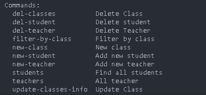

# PHASE-3-PROJECT

For this assignment, we'll be working with a school management domain.

We have three models: `Class`, `Teacher`, and `Student`.

For our purposes, a `Class` has many `Teacher`s and `Student`s .

`Student`s, and a `Teacher` belongs to a `Class` .

`Class` - `Student` is a many to many relationship.

`Class` - `Teacher` is a many to many relationship.

**Note**: You should draw your domain on paper or on a whiteboard _before you

start coding_. Remember to identify a single source of truth for your data.

[Entity relationship diagram](https://dbdiagram.io/d/SCHOOL-MANAGEMENT-SYSTEM-659aa9a7ac844320ae65f771)

## Project Setup

Clone the project

```bash
  git clone git@github.com:irungudennisnganga/PHASE-3-PROJECT.git
```

Go to the project directory

```bash
  cd PHASE-3-PROJECT
```

open folder in text editor  

```bash
  code .
```

Run this command on the terminal to install the required dependancy from the pipfile

```bash
  pipenv install
```

After installing the required dependancy to run the application enter the virtual environment using the command below.

```bash
  pipenv shell
```

Follow the instruction above to use and modify the project

## Instructions

Welcome to the end of Phase 3! You've learned about a lot in this unit:

### Python fundamentals

* Data structures (and more recently, algorithms).
* Object-oriented programming.
* Object inheritance.
* Class attributes and methods.
* Configuring applications.
* SQL fundamentals.
* Table relations in SQL.
* Object-relational mapping with Python.
* Object-relational mapping with SQLAlchemy.
* Building CLIs.

In this project, we're going to use these skills to create a CLI. We want you to display knowledge of as much from Phase 3 as you can- you won't be able to fit everything in, but we'll expect to see:

* A CLI application that solves a real-world problem and adheres to best      practices.
* A database created and modified with SQLAlchemy ORM with 3+ related tables.
* A well-maintained virtual environment using Pipenv.
* Proper package structure in your application.
* Use of lists, dicts, and tuples.
* Appropriate and accurate implementation of an algorithm from the Data Structures and Algorithms Canvas module .

## HOW TO RUN THE PROGRAM FROM THE COMMAND LINE USING CLICK

On the teminal run this command to enter where the files are located

```bash
  cd lib
```

this command will take you to the lib folder where our working files are located

To see the commands that are available in our project run this command

```bash
  python debug.py --help
```

This command will make all methods associated to our classes .

To run a specific command select from the command list provided after running the above command .

```bash
  python debug.py new-student
```

For this command when runned on the terminal it will make a prompt available at the terminal to enter data regarding the creation of a new student instance .

There are other methods to work out with all the same example as above .

NB: As one can note according to python we are supposed to use snake_case to to declare names  but for this methods snake_case do not apply this is because click uses hyphen and not underscore

As you run this command you will note that change

```bash
  python debug.py --help
```



To simply run other command simply use this format

```bash
  python debug.py [command]
```

As communicated above after running the commnad a prompt will be made available to enter the data regarding the command to be completed

## Author

[irungudennis](https://github.com/irungudennisnganga/irungudennisnganga)

## License  

MIT License

Copyright (c) 2024 irungudennisnganga

Permission is hereby granted, free of charge, to any person obtaining a copy
of this software and associated documentation files (the "Software"), to deal
in the Software without restriction, including without limitation the rights
to use, copy, modify, merge, publish, distribute, sublicense, and/or sell
copies of the Software, and to permit persons to whom the Software is
furnished to do so, subject to the following conditions:

The above copyright notice and this permission notice shall be included in all
copies or substantial portions of the Software.

THE SOFTWARE IS PROVIDED "AS IS", WITHOUT WARRANTY OF ANY KIND, EXPRESS OR
IMPLIED, INCLUDING BUT NOT LIMITED TO THE WARRANTIES OF MERCHANTABILITY,
FITNESS FOR A PARTICULAR PURPOSE AND NONINFRINGEMENT. IN NO EVENT SHALL THE
AUTHORS OR COPYRIGHT HOLDERS BE LIABLE FOR ANY CLAIM, DAMAGES OR OTHER
LIABILITY, WHETHER IN AN ACTION OF CONTRACT, TORT OR OTHERWISE, ARISING FROM,
OUT OF OR IN CONNECTION WITH THE SOFTWARE OR THE USE OR OTHER DEALINGS IN THE
SOFTWARE.
